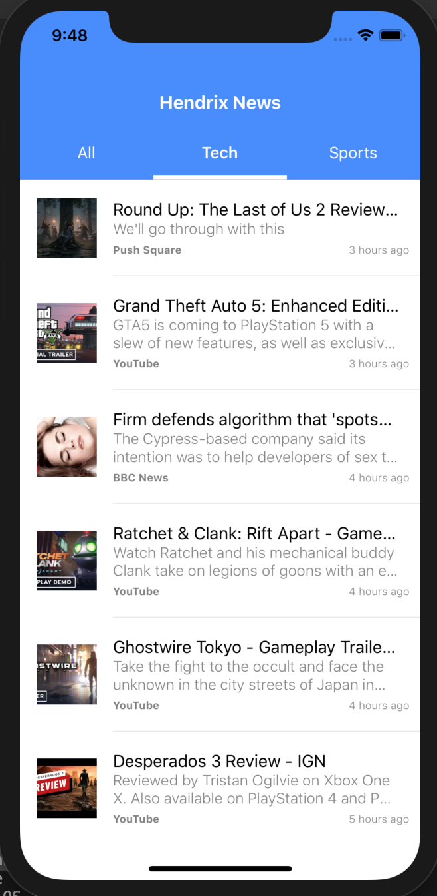

# React Native news app with Redux.

## **Getting Started**

To get this project running on your local machine, you need a working [development environment](https://reactnative.dev/docs/environment-setup) and then do the following:

- Clone this repo

- `npm install` to install all the required dependencies specified in the package file.
- `react-native run-ios` to install and start the ios app
- `react-native run-ios` to install and start the android app. You may need to have an emulator up and running on android studio before you run this command.

## **Project overview**

This project is a react native app that runs on both ios and android platforms. It also uses redux for state management.

### **General functionality:**

- Display with of news.
- Open any news article using a webview.
- You can also share the news article with friends

### **What you get:**

A good start for react native beginners!
